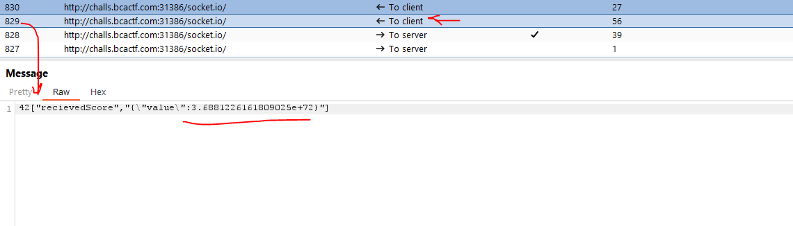

# Introduction
This is a that has websocket connection and source code is available

## Challange Discription

You need to get 1e20 cookies, hope you have fun clicking!

Web servers: challs.bcactf.com:31386

Static resources: [Source_Code](../resources/Cookie-Clicker/provided_cookie_clicker.js)


## Step1

when checking how each click is ending a JSON message and also source code beside it i guess there is a bug on server side code.
when we set power to a high value and send to server the **sessions[socket.id]** new value will be huge.



But the problem is the error that happend when we set power value to high 

```javascript
if (json.power > 10) {
            socket.emit('error', JSON.stringify({"value":oldValue}));
        }
```

The thing is that if we hold the server response and send another request fast enugh with new value set ( Race Condition ) we might bypass the server setting back value of **sessions[socket.id]**  to what was before so we can read the flag

