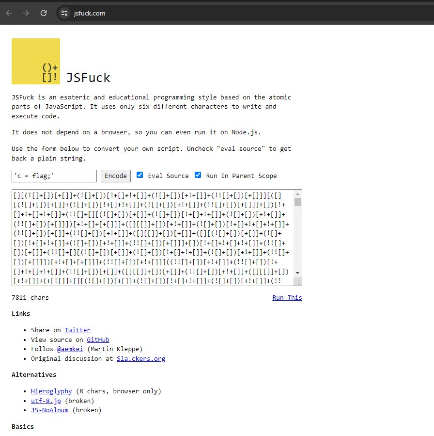
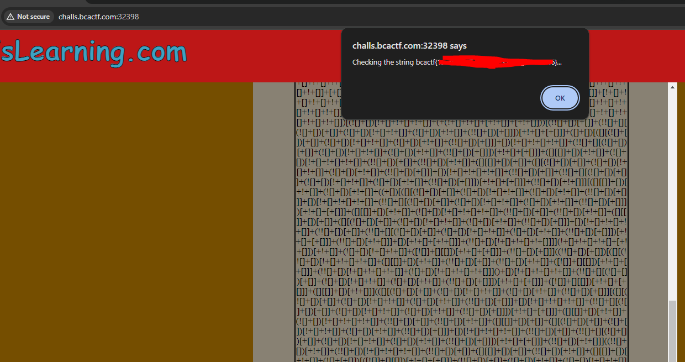

# Introduction
This is a task to Analyze source code and try to get the flag

## Challange Discription

Hey, can you help me on this Javascript problem? Making strings is hard.

Resources:
Web servers: challs.bcactf.com:32398

Static resources: [Source_Code](../resources/JSLearning/server.js)

## Step1

When we check the source code we see that only these characters are allowed:

> ERROR: disallowed characters. Valid characters: '[', ']', '(', ')', '+', and '!'.

By searching in web we see that there is something called **JSFuck** which is a way of writing code in Javascript with only following chars:

>   '[', ']', '(', ')', '+', and '!

We can use sebsites that will take js code and encode it inot **JSFuck** . Since our input is in **eval** function we can read flag by assigning it's value to **C** using bellow payload 

> 'c = flag;'

The flag 

