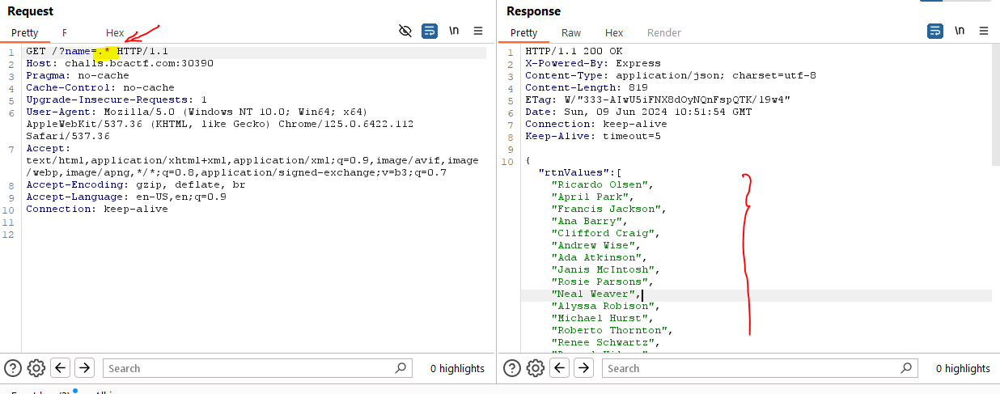
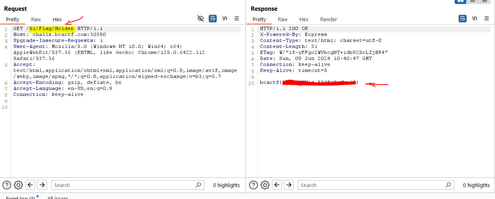

# Introduction
This is a rather simple web challange to Read Express server file config and routes and find vaulnerability

## Challange Discription

I found this database that does not use SQL, is there any way to break it?

Web servers: challs.bcactf.com:30390

Static resources:  [Source_Code](../resources/NoSQL/provided.js)


## Step1

Looking at source code we see that there are 2 main routes one is static second is dynamic

1) ( / )
2) ( /:id/:firstName/:lastName )

In first route we must provide a **name** query parameter and within that there is a simple check to match entry as follow

```js
let goodLines = []
    text.forEach( line => {
        if (line.match('^'+req.query.name+'$')) {
            goodLines.push(line)
        }
    });
    res.json({"rtnValues":goodLines})
```

If we pay attension our query is in middle of a **regex** which means we can manipulate the **regex** query.

we can use ( .* ) in our input so that regex will match anything and we have dump of entire table :




## Step2

Having all entries we need to query second route with **"Flag Holder"** from above route

Using soruce code we can use dynamic path like following to retrive the flag:

