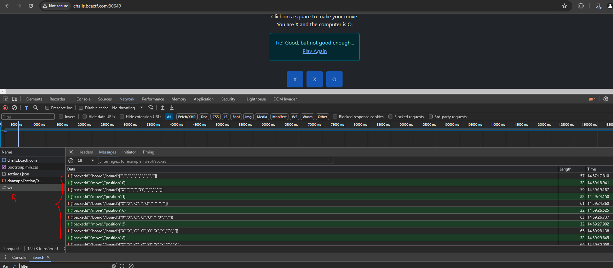
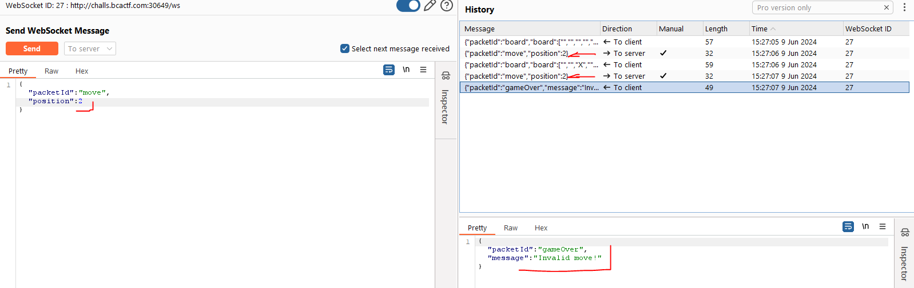
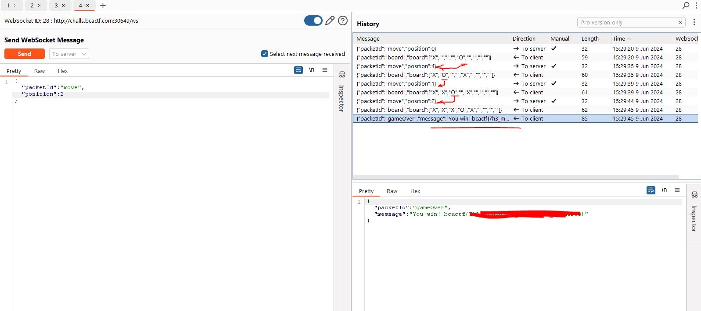

# Introduction
This is good challange to work with websockets and manipulate packets

## Challange Discription

I found this database that does not use SQL, is there any way to break it?

My friend wrote this super cool game of tic-tac-toe. It has an AI he claims is unbeatable. I've been playing the game for a few hours and I haven't been able to win. Do you think you could beat the AI?

Web servers:
challs.bcactf.com:30649

## Step1

First we work with site as a normal user and see that there are some wbsocket comunication:

So we can capture **websocket** traffic with burp and try to manipulate it

## Step2

Trying to repeat same *WS* calls we see that when we want to play "X" in same position multiple times we get error from "WS Server" and get disconnected:

But how about filling Computer "O" moves, if we check we see that we can replace them!!!

so from this we can easi;y win by manipulating Computer Moves and get flag:

