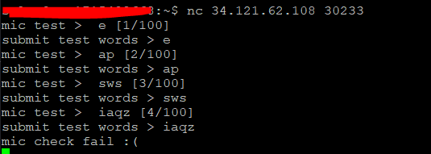
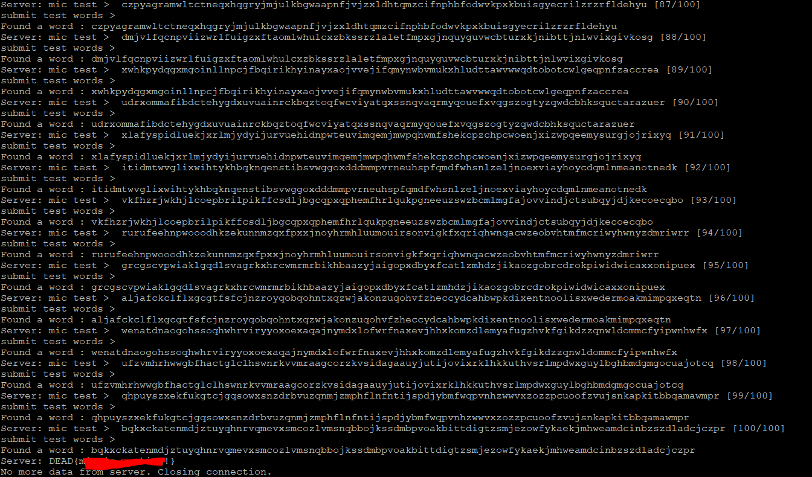

# Introduction
This is a Misc challange that needs intracting with server through TCP with getting 100 replies (extracet data ) And sending 100 responses

## Challange Discription

Description

Author: UKO

mic is it ok?
mic is it ok?

Remote Access: Click Here!
nc 34.121.62.108 30233

## Step1

When we run **nc 34.121.62.108 30233** we see that the server types word and wants us to repeat that word in response.

If we response slowly the servers closes the connection:




## Step2

Since we as human are not fast enough we need a program to automate responses to the server fast. i used python that does this ( it uses regest to extract the word it needs to reply)

```python
import socket
import re

pattern = r" (\w+) \["  # Regex for matching words
def interactive_tcp_client(host, port):
    # Create a TCP/IP socket
    sock = socket.socket(socket.AF_INET, socket.SOCK_STREAM)
    
    try:
        # Connect to the server
        sock.connect((host, port))
        print(f"Connected to {host}:{port}")
        
        while True:
            # Receive data from the server
            data = sock.recv(4096).decode('utf-8')
            if not data:
                print("No more data from server. Closing connection.")
                break
            print(f"Server: {data.strip()}")
            
            # Check if the server is expecting a response
            if '>' in data:
                match = re.findall(pattern, data)

                if match:
                    
                    user_input = match[0]
                    print("Found a word:", user_input)

                
                # Send user input to the server
                sock.sendall(user_input.encode('utf-8'))
                
                # Optionally, send a newline character if required by the protocol
                sock.sendall(b'\n')
                
    except Exception as e:
        print(f"An error occurred: {e}")
    finally:
        # Close the socket
        sock.close()

# Replace with the actual server address and port
interactive_tcp_client('34.121.62.108', 30233)
```

And in the ends we get the flag:

