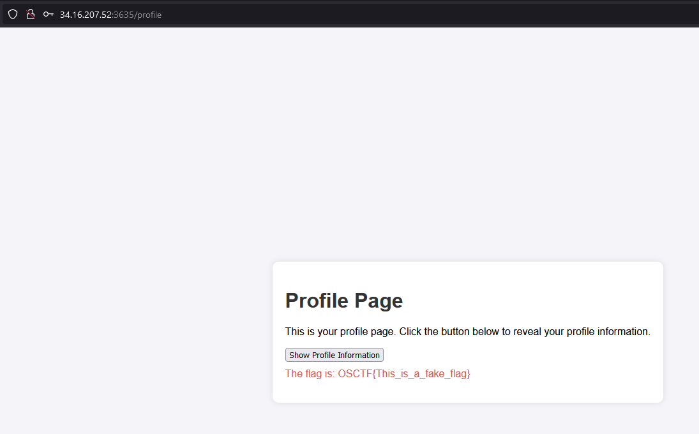

# Introduction
This is SQLi based injection that had an important lesson for me.

## Challange Discription

pfft.. Listen, I've gained access to this login portal but I'm not able to log in. The admins are surely hiding something from the public, but... I don't understand what. Here take the link and be quiet, don't share it with anyone

Author: @5h1kh4r
Web instance: http://34.16.207.52:3635/ 

## Step1

When we opne the link we are face with a login screen.


As challange name implies we can try SQLi, i first used this:

```SQL
user - > admin' or 1=1 --
pass - > aaaaa
```



I was stuck here for sometimes as i did not expect it to not show the real flag. the thing that i was missing was that i did not have the query so, i must try reversing the inputes top:

```SQL
user - > admin
pass - > ' or 1=1 --
```

And it worked


## Extra

After i read writeups about this challange i saw that there is a path after login that if it is 'admin' user it is redirected to **/admin** but if it is not admin redirected to **/profile**

we could also change the path by ourself and go to **/admin** to get the flag