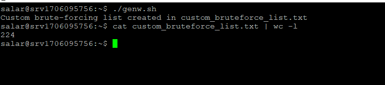
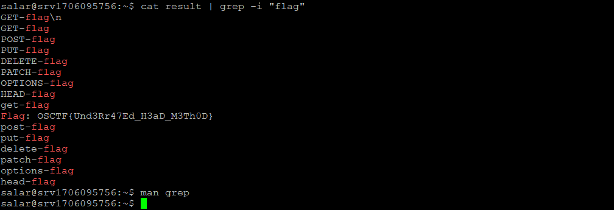

# Introduction
This is a mixed of using directory fuzzing and checking http headers in response

## Challange Discription

I was playing cricket yesterday with my friends and my flipped a coin. I lost the toss even though I got the lucky heads.

Web Instance: http://34.16.207.52:4789

Hint

Try making a custom directory/file bruteforcing list that is made in the following format: (http_request_methods)-(words_related_to_ctf)

## Step1

According to the Hint we must have a wordlist that contains the pattern **(http_request_methods)-(words_related_to_ctf)**

So we use bellow code to generate one :

```bash
#!/bin/bash

# Define the list of HTTP request methods (both lowercase and uppercase)
http_methods=("GET" "POST" "PUT" "DELETE" "PATCH" "OPTIONS" "HEAD" "get" "post" "put" "delete" "patch" "options" "head")

# Define the list of words related to CTF
ctf_words=("admin" "login" "flag" "upload" "download" "config" "backup" "secret" "hidden" "shell" "user" "password" "robots" "sitemap" "hidden" "secure")

# Create the output file
output_file="custom_bruteforce_list.txt"

# Empty the output file if it already exists
> $output_file

# Generate the combinations and save to the output file
for method in "${http_methods[@]}"; do
  for word in "${ctf_words[@]}"; do
    echo "${method}-${word}" >> $output_file
  done
done

echo "Custom brute-forcing list created in ${output_file}"
```

and then we have a wordlist to run 




## Step2

Now we need to run our wordlist and check headers in response for flag.
i used one line command as bellow ( then searched trough result):

```bash
for i in $(cat custom_bruteforce_list.txt); do echo "$i" >> result && curl -I http://34.16.207.52:4789/$i >> result; done
```

