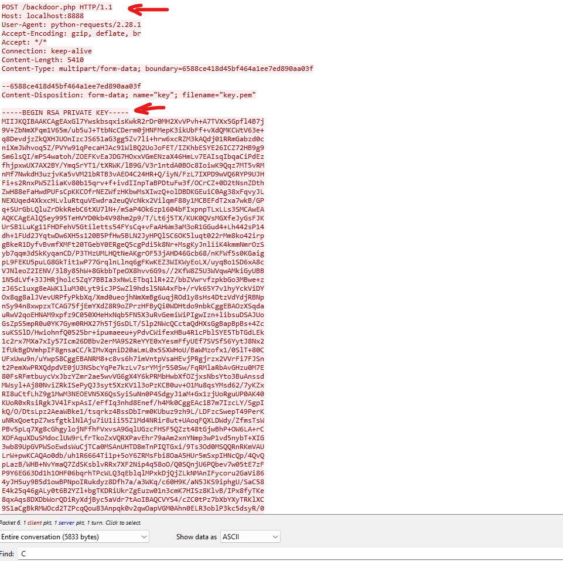
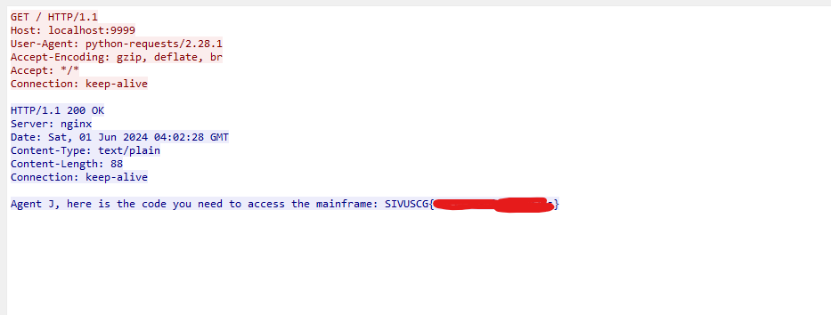

# Introduction
This is a simple Forensic challange two decrypt SSL/TLS traffic

## Challange Discription

One of our machines was recently hit with malware and appears to have opened a backdoor. We were able to get this PCAP from around the time when it was accessed but aren't sure what was exfiltrated from the network. Take a look and see if you can make sense of it!

Author: tsuto

File : [Secret File](https://github.com/salarsalimi/CTF/tree/main/US%20Cyber%20Open%20Season%20IV/resources/certified)

## Step 1

At first preview in pcap file we are facing a connection that happening overTLS.
Some packets beffore that the attacker is sending backdoor.php file that contains some usefull information:
- RSA Private Key
- Certificate key

At next step we will use this **Private Key** to decrypt packets that were encrypted with TLS.

## Step 2

In wireshark follow this config:
- Access Protocol Preferences:
    - Go to Edit -> Preferences in the menu.
    - Expand the Protocols section.
    - Find the protocol you are dealing with, most likely TLS.

- Set Up RSA Keys:
    - Under Protocols -> TLS, you will find a field labeled RSA keys list.
    - Click on Edit next to the RSA keys list.

- Add Your Private Key:
    - In the new window, click on New.
    - You will need to fill out the fields:
        - IP Address: Enter the IP address of the server.
        - Port: Enter the port number used by the TLS traffic, commonly 443 fo HTTPS.
        - Protocol: Enter http (or another relevant protocol).
        - Key File: Browse and select your private key file (in PEM format).
        - Password: If your private key is encrypted with a password, enter it here.

 In the end we can read encrypted traffic:

 