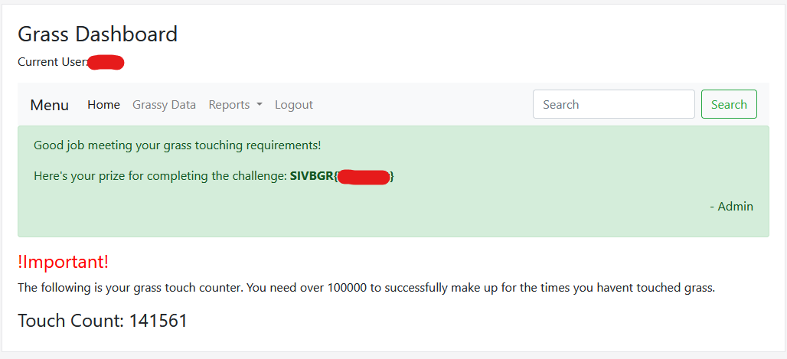
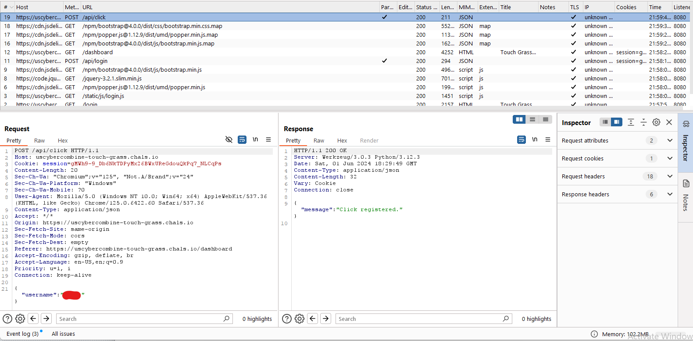

# Introduction
This is a rather simple web challange to get familliar with how to send request 

## Challange Discription

ARIA has ordered you to touch grass. Now you actually have to do it. Make up for all the times you havent touched it.
https://uscybercombine-touch-grass.chals.io/

## Webpage 

After signup we are faced with a simple dashboard 



openning the source code we see two comment line at end of code

``` html
<!DOCTYPE html>
<html>
    <head>
        <title>Touch Grass Inc.</title>
        <link rel="stylesheet" href="https://cdn.jsdelivr.net/npm/bootstrap-icons@1.8.2/font/bootstrap-icons.css">
        <link rel="stylesheet" href="https://cdn.jsdelivr.net/npm/bootstrap@4.0.0/dist/css/bootstrap.min.css" integrity="sha384-Gn5384xqQ1aoWXA+058RXPxPg6fy4IWvTNh0E263XmFcJlSAwiGgFAW/dAiS6JXm" crossorigin="anonymous">
        <link rel="stylesheet" href="/static/css/style.css">
        <script src="https://code.jquery.com/jquery-3.2.1.slim.min.js" integrity="sha384-KJ3o2DKtIkvYIK3UENzmM7KCkRr/rE9/Qpg6aAZGJwFDMVNA/GpGFF93hXpG5KkN" crossorigin="anonymous"></script>
        <script src="https://cdn.jsdelivr.net/npm/popper.js@1.12.9/dist/umd/popper.min.js" integrity="sha384-ApNbgh9B+Y1QKtv3Rn7W3mgPxhU9K/ScQsAP7hUibX39j7fakFPskvXusvfa0b4Q" crossorigin="anonymous"></script>
        <script src="https://cdn.jsdelivr.net/npm/bootstrap@4.0.0/dist/js/bootstrap.min.js" integrity="sha384-JZR6Spejh4U02d8jOt6vLEHfe/JQGiRRSQQxSfFWpi1MquVdAyjUar5+76PVCmYl" crossorigin="anonymous"></script>
    </head>
    <body>
      <div id="content">
        <h3>Grass Dashboard</h3>
        <p>Current User: salar</p>
        <nav class="navbar navbar-expand-lg navbar-light bg-light">
            <a class="navbar-brand" href="javascript:void(0)">Menu</a>
            <button class="navbar-toggler" type="button" data-toggle="collapse" data-target="#navbarSupportedContent" aria-controls="navbarSupportedContent" aria-expanded="false" aria-label="Toggle navigation">
              <span class="navbar-toggler-icon"></span>
            </button>
          
            <div class="collapse navbar-collapse" id="navbarSupportedContent">
              <ul class="navbar-nav mr-auto">
                <li class="nav-item active">
                  <a class="nav-link" href="javascript:void(0)">Home <span class="sr-only">(current)</span></a>
                </li>
                <li class="nav-item">
                  <a class="nav-link" href="javascript:void(0)">Grassy Data</a>
                </li>
                <li class="nav-item dropdown">
                  <a class="nav-link dropdown-toggle" href="#" id="navbarDropdown" role="button" data-toggle="dropdown" aria-haspopup="true" aria-expanded="false">
                    Reports
                  </a>
                  <div class="dropdown-menu" aria-labelledby="navbarDropdown">
                    <a class="dropdown-item" href="javascript:void(0)">Grass</a>
                    <a class="dropdown-item" href="javascript:void(0)">More Grass</a>
                    <div class="dropdown-divider"></div>
                    <a class="dropdown-item" href="javascript:void(0)">Even More Grass</a>
                  </div>
                </li>
                <li class="nav-item">
                  <a class="nav-link" href="/logout">Logout</a>
                </li>
              </ul>
              <form class="form-inline my-2 my-lg-0">
                <input class="form-control mr-sm-2" type="search" placeholder="Search" aria-label="Search">
                <button class="btn btn-outline-success my-2 my-sm-0" type="submit">Search</button>
              </form>
            </div>
          </nav>
        
        <div class="alert alert-success" role="alert">
            <p>Good job meeting your grass touching requirements!</p>
            <p>Here's your prize for completing the challenge: <b>SIVBGR{T0uch_1t}</b></p>
            <p style='text-align:right'>- Admin</p>
        </div>
        
        
        <h4 style="color:red">!Important!</h4>
        <p>The following is your grass touch counter. You need over 100000 to successfully make up for the times you havent touched grass.</p>
        <h4>Touch Count: 141561</h4>
        <!-- Put clickable image of grass here. Need javascript to send POST when clicked-->
        <!-- New click API at /api/click, remove the admin version ASAP -->
      </div>
    </body>
</html>
```

## Step 1 

First we need to create send a **POST** request using **JavaScript** to api "/api/click" , so we can use XHR

``` javascript
var xhr = new XMLHttpRequest();
var url = '/api/click';
var jsonData = {
    username: 'user'
};

xhr.open('POST', url, true);
xhr.setRequestHeader('Content-Type', 'application/json');
xhr.withCredentials = true; // Allow cookies to be sent with the request

xhr.onreadystatechange = function() {
    if (xhr.readyState == 4 && xhr.status == 200) {
        // Request was successful
        console.log(xhr.responseText);
    }
};

xhr.send(JSON.stringify(jsonData));

```

## Step 2

we can capture the request in burp and then repeat it 



## step 3 

we use ffuf with a large enough wordlist and request capture at **step 2**  in order to make lots of request.
for example here we can edit the request and add a custom header to use our wordlist fuzz:

```Burp
POST /api/click HTTP/1.1
Host: uscybercombine-touch-grass.chals.io
Cookie: session=kjaoIIU1Om2MayTntEoaOMwUN7SyUeS_oEOnOZp-Pk4
Content-Length: 20
Sec-Ch-Ua: "Chromium";v="125", "Not.A/Brand";v="24"
Sec-Ch-Ua-Platform: "Windows"
Sec-Ch-Ua-Mobile: ?0
User-Agent: Mozilla/5.0 (Windows NT 10.0; Win64; x64) AppleWebKit/537.36 (KHTML, like Gecko) Chrome/125.0.6422.60 Safari/537.36
Content-Type: application/json
Accept: */*
Origin: https://uscybercombine-touch-grass.chals.io
Sec-Fetch-Site: same-origin
Sec-Fetch-Mode: cors
Sec-Fetch-Dest: empty
Referer: https://uscybercombine-touch-grass.chals.io/dashboard
Accept-Encoding: gzip, deflate, br
Accept-Language: en-US,en;q=0.9
Priority: u=1, i
Connection: keep-alive
X: FUZZ

{"username":"user"}
```

The final command used is bellow:

```bash
ffuf -w wordlist/larg.txt -request a.txt
```
