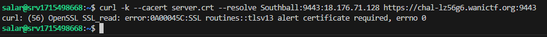
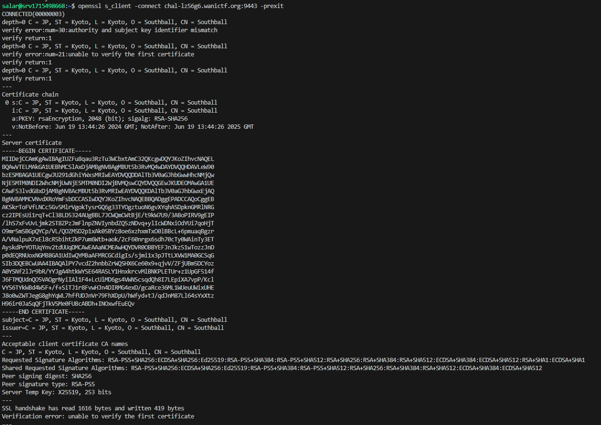
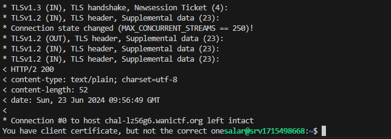

# Introduction
This is a nice challange to get familliar with SNI, TLS, Certificates, ...

## Challange Discription

I read the specification for TLS and made a problem.

Hint: curl --cacert server.crt --resolve Southball:<PORT>:<IP> https://chal-lz56g6.wanictf.org:9443

Static resources: [Source_Code](../resources/Tls_spec/web-tls-spec.zip)


## Step1 

By inspecting file <span style="color:red">server.crt</span> we see that ther server we want to connect to is using a certificate with **cn=Southball** but the server is behind https://chal-lz56g6.wanictf.org:9443 so we must use something like SNI, in burp that is using --resolve option :



We see that there is client certificate required ( we could check also using openssl):




## Step2 

we have CA <span style="color:red">Private</span> and <span style="color:red">Public</span> keys in files attached so we can sign a client certificate using bellow commands

1. create a private key for client certificate
```bash
openssl genpkey -algorithm RSA -out client.key
```

2. create a certificate sign request (csr) by that private key
```bash
openssl req -new -key client.key -out client.csr
```

3. Sign the csr file by CA can generate certificate
```bash
openssl x509 -req -in client.csr -CA intermediateCACert.pem -CAkey intermediateCAKey.pem -out client.crt -days 365 -sha256
```

Now we can send request using client certificate 

```bash
curl -k --cacert server.crt --cert client.crt --key client.key --resolve Southball:9443:18.176.71.128 https://chal-lz56g6.wanictf.org:9443
```

But the message says that we don't have the correct client certificate:



From here i tried different **CN** fields like Southball, Northball, *, ... but none worked.
